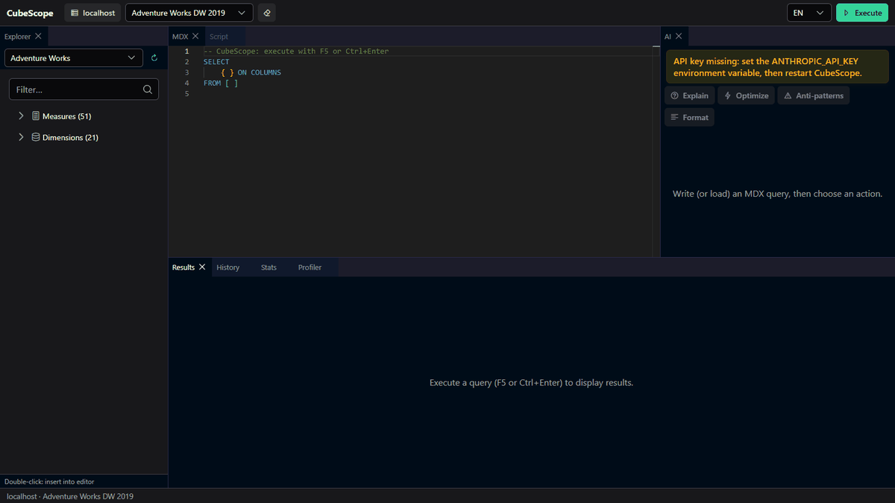
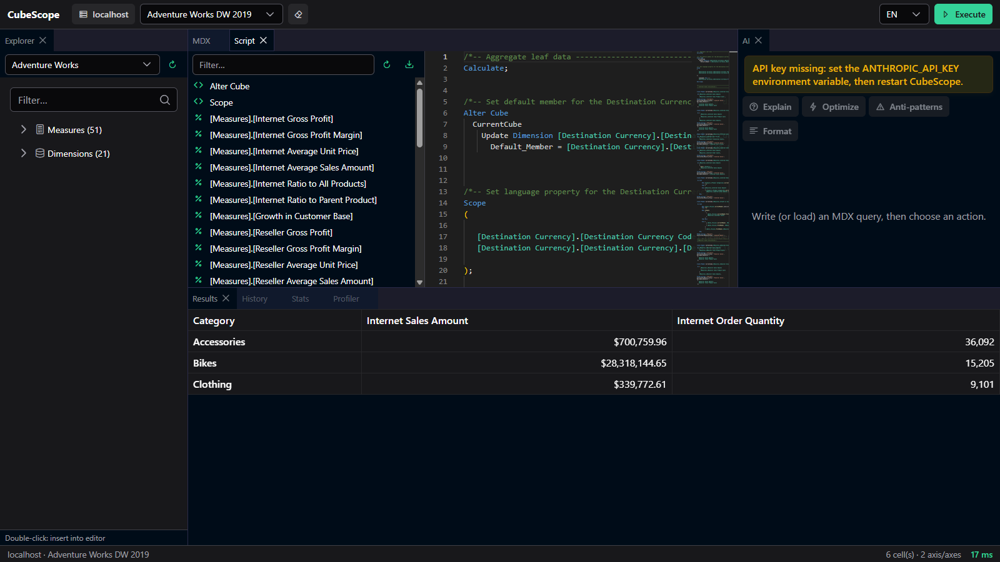
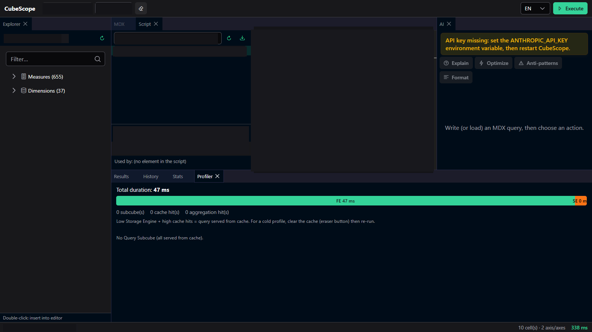

# CubeScope

**A modern workbench for SSAS Multidimensional developers.** Write, understand,
measure and maintain MDX against existing cubes — with a built-in AI expert.

CubeScope is the spiritual successor to MDX Studio: a single self-contained
executable that launches a local web app in your browser. No install, no server
component to deploy, no cloud.



> **Scope.** CubeScope targets **SSAS Multidimensional** only. Tabular, Power BI
> and DAX are permanently out of scope by design — there is no multi-engine
> abstraction and none is planned.

---

## Features

- **MDX editor** — Monaco with a hand-written MDX grammar (syntax highlighting,
  reference detection), autocompletion of measures, hierarchies and members
  (lazy-loaded after `.`), structural folding of `{ }` / `( )` / `SCOPE` blocks
  and `// #region` sections, execute with `F5` / `Ctrl+Enter`, cancel in flight.
- **Results grid** — virtualized grid handling wide crossjoins; export to CSV
  or copy to the clipboard (Excel-friendly).
- **Productivity helpers** — a reusable MDX **snippets** library (save / insert /
  delete) and a **calculated-member scaffold** (WITH MEMBER / CREATE MEMBER).
- **Metadata explorer** — filterable tree of measures and dimensions (DMV-backed);
  double-click inserts at the cursor. Measure descriptions surface as hover
  tooltips and in the MDX autocomplete documentation.
- **Query profiler** — per-query **Formula Engine vs Storage Engine** split from
  SSAS traces, `Query Subcube` breakdown (readable text), cache and aggregation
  hits, plus a persisted run history with before/after comparison of two runs.
  *(Requires SSAS admin rights — see Prerequisites.)*
- **Perfmon stats** — per-query perfmon counter deltas (MDX / cache / storage
  engine), streamed live over SignalR.
- **MDX Script & dependencies** — read the cube's MDX Script, browse calculated
  members / named sets / SCOPEs and their dependency graph; export a Markdown
  doc of the cube.
- **SSDT project mode** — open the `.cube` file of an SSDT Multidimensional project
  (type a path or use the built-in file browser), edit the MDX Script with
  `// #region` grouping and folding, save round-trips into the `.cube` (plus a
  plain-text `.mdxscript.mdx` export for readable Git diffs), and deploy the script
  alone to a dev cube (BIDS Helper style, with a divergence guard and dev-catalog
  warning) without a full project deploy. On divergence a side-by-side Monaco diff
  shows server vs project before you overwrite; you can also edit a calculated
  member's properties (format string, display folder, description) with round-trip
  writeback into the `.cube`.
- **AI assistant** — Explain / Optimize / Detect anti-patterns / Format, powered
  by the Anthropic API (`claude-opus-4-8`), with the relevant cube metadata
  injected into the context. *(Requires `ANTHROPIC_API_KEY` — see Prerequisites.)*
- **Cache management** — clear the SSAS cache of a catalog (explicit confirmation).
- **History** — every query stored locally (SQLite), filterable, reloadable.
- **Bilingual UI** — French (default) and English, switchable at runtime.

| Metadata explorer & MDX Script | Query profiler |
|---|---|
|  |  |

---

## Prerequisites

**To run the published executable:**

- **Windows** (x64). CubeScope uses Windows-only perfmon APIs and Integrated
  Security — it is a Windows tool by design.
- **Network access** to an SSAS **Multidimensional** instance. All connections
  use **Windows Integrated Security** — no credentials are stored anywhere.
- **SSAS administrator rights** on the target instance are required for the
  **Query Profiler** (it creates a server-side trace). The rest of the app works
  without them.
- **"Performance Monitor Users" group** membership on the SSAS server, plus the
  **Remote Registry** service running, are required for the **Perfmon stats**
  panel when profiling a remote server.
- **`ANTHROPIC_API_KEY`** environment variable for the **AI assistant**. If it
  is absent, the AI panel degrades gracefully with a clear message; everything
  else keeps working. The key is read from the environment only — it is never
  stored locally.

**To build from source, additionally:**

- **.NET 10 SDK** (currently preview) — target framework `net10.0-windows`.
- **Node.js LTS** — builds the Vue SPA that gets embedded into the executable.

---

## Run

Download `cubescope.exe` from the [latest release](../../releases/latest),
then:

```powershell
.\cubescope.exe
```

It starts Kestrel on a free localhost port and opens your default browser.
Connect to your SSAS server (a hostname, or `host:port` for a named instance on
a fixed port), pick a catalog, and start writing MDX.

---

## Build from source

```powershell
# Restore + build + run the .NET unit tests (excludes live-SSAS integration tests)
dotnet build CubeScope.slnx -c Release
dotnet test  CubeScope.Core.Tests -c Release --filter "Category!=Integration"

# Front-end (optional in dev — the publish step does this automatically)
cd CubeScope.Web
npm ci
npm run build
```

### Development loop

Run the server and the Vite dev server side by side (Vite proxies `/api` and
`/hubs` to Kestrel):

```powershell
# Terminal 1 — API on a fixed port, no auto-open
dotnet run --project CubeScope.Server -- --port 5199 --no-browser

# Terminal 2 — Vue dev server with HMR
cd CubeScope.Web
npm run dev
```

### Publish the single executable

```powershell
dotnet publish CubeScope.Server -c Release -r win-x64 --self-contained true `
  -p:PublishSingleFile=true -o publish
```

This builds the Vue SPA, embeds it into `wwwroot`, and produces a single
self-contained `publish/cubescope.exe` (~180 MB — it bundles the .NET runtime).

---

## Architecture

A single executable, `cubescope.exe`: ASP.NET Core 10 (Kestrel on a free
localhost port) serving a Vue 3 SPA.

| Project | Role |
|---|---|
| **CubeScope.Core** | Business services — SSAS connectivity, DMV/metadata, cell-set mapping, profiler aggregation, MDX tokenizer, AI service. No web dependency. |
| **CubeScope.Server** | Minimal API + SignalR hubs + SPA hosting. Produces the executable. |
| **CubeScope.Web** | Vue 3 + TypeScript (strict) + Vite. Monaco editor, dockview layout, PrimeVue components. |
| **CubeScope.Spike** | Read-only SSAS server-behaviour harness kept as a non-regression tool (`--discover`). |

Key technical choices:

- **SSAS connectivity** via `Microsoft.AnalysisServices.AdomdClient.NetCore`
  (ADOMD.NET Core) for queries and DMVs, and AMO (`.NetCore` variant) only to
  read the MDX Script and resolve object IDs.
- **Metadata** from `$SYSTEM.MDSCHEMA_*` DMVs, members lazy-loaded and cached.
- **Profiler** built on SSAS traces (`QueryEnd`, `QuerySubcube` /
  `QuerySubcubeVerbose`, cache/aggregation events), streamed to the UI over
  SignalR.
- **Local state** in a single SQLite file (history, recent connections, layouts).
- **MDX parsing** is a pragmatic tokenizer (no full AST) — it powers highlighting,
  reference detection and the dependency graph.

---

## Security notes

- All SSAS connections use **Windows Integrated Security**. No credentials are
  read from, or written to, disk or config.
- The Anthropic API key is read from the `ANTHROPIC_API_KEY` environment variable
  only.
- **Transitive advisories (resolved):** the ADOMD.NET Core client used to pull in
  `Microsoft.Identity.Client` 4.56.0, flagged by NU1901/NU1902 (low/moderate).
  CubeScope now pins `Microsoft.Identity.Client` 4.86.1 directly, forcing the
  transitive up to a patched version — `dotnet list --vulnerable` is clean.
  (CubeScope does not use Entra ID authentication — Integrated Security only — so
  the affected code path was never exercised anyway.)

---

## License

[MIT](LICENSE) © 2026 David Simon — Financière de la Cité.
